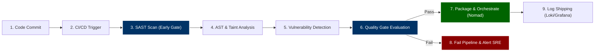

# 🛡️ DevOps & DevSecOps Engineering Portfolio

> **Comprehensive Internship Portfolio (January 2026 – April 2026)**  
> A detailed index of enterprise-grade cloud architecture, production-simulated cluster operations, security tool evaluations, and policy-driven standardization frameworks completed during the engineering internship.

---

## 👨‍💻 Engineer Profile

*   **Engineer:** **Soham Mukherjee**
*   **Role:** DevOps & DevSecOps Intern
*   **Affiliations:** **Springer Capital Investments LLC (USA)** & **Acumen Strategy**
*   **Duration:** January 6, 2026 – April 6, 2026 (3 Months)
*   **Focus Areas:** High-Availability Cluster Orchestration (Nomad, Consul, Vault), Infrastructure as Code (Terraform, Vagrant), Policy-driven CI/CD (GitHub Actions), Enterprise SAST Standardization, and Observability (Loki, Grafana).

---

## 📁 Internship Credentials & Certificates

The `all_certificates/` folder contains official documentation verifying the completion, exceptional performance, and multi-disciplinary impact of the internship:

### 1. 🎓 [Internship Completion Certificate](file:///c:/Users/soham/Desktop/Backup/DevOps-All_Intern_Work/all_certificates/Springer%20Completion%20Letter.pdf)
*   **Issuer:** Isaac Rosenthal, Managing Partner, **Springer Capital Investments LLC (USA)**
*   **Key Contributions Recognized:**
    *   **Data & Analytics Engineering:** Developed robust **Silver layer data transformations** and contributed to the architecture of the **Gold layer data models** optimized for business intelligence reporting and dashboard consumption.
    *   **Query & Schema Optimization:** Ensured strict alignment across database query design, schema definitions, and automated data quality tests.
    *   **Team Workflows:** Contributed heavily to collaborative software engineering workflows utilizing advanced git version control and pull-request gating policies.

### 2. 📝 [Official Letter of Recommendation](file:///c:/Users/soham/Desktop/Backup/DevOps-All_Intern_Work/all_certificates/Springer%20Recomendation%20Letter.pdf)
*   **Issuer:** Isaac Andrew Rosenthal, Managing Partner, **Springer Capital**
*   **Key Skills & Technical Acumen Highlighted:**
    *   Strong understanding of **software engineering principles, complex data workflows, and clean coding practices**.
    *   Commended for a **structured, highly disciplined, and analytical approach** to complex problem-solving.
    *   Officially recommended for senior roles in **Software Engineering, Backend Development, Data Engineering, and Systems Design**.

### 3. ✉️ [Acumen Strategy Appreciation Letter](file:///c:/Users/soham/Desktop/Backup/DevOps-All_Intern_Work/all_certificates/Thankyou%20letter%20Acumen%20(1).pdf)
*   **Issuer:** **Acumen Strategy** / Springer Capital Investments LLC
*   **Key Frontend & Web Engineering Work recognized:**
    *   **Modern Web Applications:** Designed and developed modern, highly responsive, and user-friendly web interfaces using the **Next.js** framework.
    *   **Performance Optimization:** Supported major **UI/UX enhancements** and optimized frontend load speeds.
    *   **Cross-Functional Impact:** Successfully bridged the gap between complex backend DevOps pipelines and user-facing frontend applications.

---

## 🛠️ Core Skills Mastered

| Domain | Tools & Technologies | Focus & Implementations |
| :--- | :--- | :--- |
| **Infrastructure as Code (IaC)** | Terraform, Vagrant, VirtualBox, Ansible | AWS multi-AZ VPC provisioning, automated local VM clustering, state management |
| **Orchestration & Containers** | HashiCorp Nomad, Docker | Batch-style container lifecycles, resource constraints, non-root execution policies |
| **Service Mesh & Networking** | HashiCorp Consul, Connect, DNS Forwarding | Service discovery, zero-trust mutual TLS (mTLS), internal DNS resolution |
| **Secrets & Security Hardening** | HashiCorp Vault, OIDC, TLS, AWS Auth | Dynamic database credentials, automated secrets injection, audit logging |
| **DevSecOps (SAST/SCA)** | Semgrep, SonarQube, Trivy, Checkmarx, Veracode, CodeQL, Fortify, Coverity, Klocwork | Centralized policy-as-code rules, reusable workflows, static evaluation reports |
| **Observability & Monitoring** | Grafana, Grafana Loki, Promtail | Logql dashboards, Docker log drivers, centralized pipeline log aggregation |
| **Software & Web Engineering** | Python, Next.js, Node.js, Bash Scripting | Silver/Gold data models, web application frontend optimization, CI scripting |

---

## 📂 Comprehensive Projects Portfolio

This repository contains five major projects representing distinct milestones during the internship. Each subdirectory is fully functional and includes specialized configurations, pipelines, and documentations.

---

### 1. 🏗️ Glynac HashiCorp Stack
*An architect-level, highly available, production-simulated cluster environment deploying the core HashiCorp ecosystem.*

*   **Location:** [`hashicorp/glynac-hashicorp-stack/`](file:///c:/Users/soham/Desktop/Backup/DevOps-All_Intern_Work/hashicorp/glynac-hashicorp-stack/)
*   **Architecture Scale:** **11-Node Distributed Cluster**
    *   **3x Consul Servers:** Dynamic service discovery, mTLS Connect mesh, and DNS forwarding.
    *   **3x Vault Servers:** High-availability secrets engine, transit encryption, and certificate authority.
    *   **3x Nomad Servers:** Cluster brain orchestrating containerized and raw binary scheduling.
    *   **2x Worker Nodes:** Dedicated compute clients running Docker workloads (e.g., `payment-api`).
*   **Deployment Options:**
    *   **Local Simulation:** Fully automated orchestration of the 11 virtual machines using a robust [`Vagrantfile`](file:///c:/Users/soham/Desktop/Backup/DevOps-All_Intern_Work/hashicorp/glynac-hashicorp-stack/Vagrantfile) and VirtualBox.
    *   **Cloud Infrastructure:** Production-grade AWS provisioning using [`terraform/`](file:///c:/Users/soham/Desktop/Backup/DevOps-All_Intern_Work/hashicorp/glynac-hashicorp-stack/terraform/) to deploy Ubuntu instances in a custom VPC with strict security groups.
*   **🔑 Dynamic Secret Injection & AWS Auth:**
    *   Configured Vault to generate dynamic database credentials on-the-fly for PostgreSQL with automated TTL expiry.
    *   Integrated OIDC and AWS IAM authentication methods to securely broker credentials to AWS EC2 without hardcoding keys.
*   **📄 Comprehensive Runbooks (DEV Tickets):**
    *   **[DEV-538]** Consul Service Discovery & Catalog registration.
    *   **[DEV-539]** Consul DNS Forwarding to resolve `.consul` domains internally.
    *   **[DEV-540]** Consul Connect mutual TLS (mTLS) zero-trust architecture.
    *   **[DEV-541]** Nomad custom Node Pools to isolate workloads based on server capability.
    *   **[DEV-542]** Nomad Security Hardening (mutual TLS, ACLs, and restricted namespaces).
    *   **[DEV-543]** Nomad Namespace segmentation to guarantee tenant isolation.
    *   **[DEV-544]** Disaster Recovery & Troubleshooting Manual (snapshots, Raft recovery, etc.).
*   **Diagnostic Tools:** Multi-language config validation via [`validate_all.ps1`](file:///c:/Users/soham/Desktop/Backup/DevOps-All_Intern_Work/hashicorp/glynac-hashicorp-stack/scripts/validate_all.ps1) checking `.tf`, `.json`, `.hcl`, and `.nomad` configuration files.
*   **📘 Master Report:** See the highly detailed architecture report: [HashiCorp Production Architecture Report.pdf](file:///c:/Users/soham/Desktop/Backup/DevOps-All_Intern_Work/HashiCorp_Production_Report_Soham_Mukherjee.pdf).

---

### 2. 🚀 DevOps Intern Final Assessment
*An end-to-end containerized batch workload pipeline demonstrating the transition from code execution to cloud orchestration and centralized observability.*

*   **Location:** [`devops-intern-final-assessment/`](file:///c:/Users/soham/Desktop/Backup/DevOps-All_Intern_Work/devops-intern-final-assessment/)
*   **Key Workload Components:**
    *   **Application Design (`hello.py`):** Structured Python application engineered as a batch job (performs a finite computation, emits structured logging, and exits explicitly with code `0` or `1`).
    *   **Diagnostic Scripting (`system_info.sh`):** A strict-mode shell script capturing real-time hardware diagnostics (memory, CPU, disk consumption).
    *   **Secure Containerization (`Dockerfile`):** A single-responsibility minimal Python base image operating with a dedicated non-root user for security hardening.
*   **CI/CD & Gates:**
    *   **GitHub Actions (`ci.yml`):** Automatically triggers on commits and PRs, executing code quality gates (flake8 static analysis) and unit-testing suites (pytest).
*   **Orchestration & Observability:**
    *   **Nomad Deployment (`hello.nomad`):** Declared as a `batch` type workload with explicit resource constraints (CPU/memory limits) and customized log retention schedules.
    *   **Centralized Logging Flow:** Captures `stdout/stderr` streams using Docker's Loki logging driver and ships them directly to **Grafana Loki**, queryable in Grafana using customized LogQL queries.

---

### 3. 🔍 Enterprise & Open-Source SAST Tools Evaluation
*An academic-grade, comprehensive evaluation comparing 11 industry-leading static analysis tools to determine speed, depth, and integration footprint.*

*   **Location:** [`sast-tools-evaluation/`](file:///c:/Users/soham/Desktop/Backup/DevOps-All_Intern_Work/sast-tools-evaluation/) & [`sast-tool-evaluation/`](file:///c:/Users/soham/Desktop/Backup/DevOps-All_Intern_Work/sast-tool-evaluation/)
*   **Evaluated Scanner Portfolio:**
    1.  **SonarQube** — Balanced code quality, maintainability, and security scanning.
    2.  **Checkmarx SAST (CxSAST)** — Enterprise uncompiled code data-flow analysis (CxQL).
    3.  **Veracode Static Analysis** — Cloud-based binary static scanning minimizing false positives.
    4.  **Fortify Static Code Analyzer** — In-depth multi-analyzer for compliance (SOC2/PCI-DSS).
    5.  **Synopsys Coverity** — High-precision semantic and interprocedural analysis for C/C++/Java.
    6.  **Klocwork** — Fast differential/incremental scanning for IoT and embedded codebases.
    7.  **Semgrep** — Blazing-fast, lightweight, open-source syntactic pattern scanner.
    8.  **GitHub CodeQL** — Advanced semantic database-backed querying engine (QL).
    9.  **Bandit** — Specialized AST-based static analysis for Python applications.
    10. **Brakeman** — Highly specialized scanner checking Ruby on Rails frameworks.
    11. **ESLint (Security)** — Syntactic linting rules for Node.js and frontend applications.
*   **Automated PDF Generators:** Uses specialized Python ReportLab scripts ([`sast-revised-tools.py`](file:///c:/Users/soham/Desktop/Backup/DevOps-All_Intern_Work/sast-tools/sast-revised-tools.py) & [`poc_script.py`](file:///c:/Users/soham/Desktop/Backup/DevOps-All_Intern_Work/SAST_PoC/poc_script.py)) to dynamically compile academic-quality security analysis reports:
    *   **[SAST Tools Revised Evaluation Report.pdf](file:///c:/Users/soham/Desktop/Backup/DevOps-All_Intern_Work/sast-tools/SAST_Tools_Revised_Evaluation_Report.pdf)**
    *   **[SAST PoC Report.pdf](file:///c:/Users/soham/Desktop/Backup/DevOps-All_Intern_Work/SAST_PoC/SAST_PoC_Report.pdf)**

---

### 4. 🛡️ Infrastructure-Wide SAST Standardization
*An enterprise governance model and policy platform designed to provide 'secure-by-default' scaffolding for organization-wide software projects.*

*   **Location:** [`infrastructure-sast-standardization/`](file:///c:/Users/soham/Desktop/Backup/DevOps-All_Intern_Work/infrastructure-sast-standardization/)
*   **Key Features:**
    *   **Centralized Scanning Logic:** Standardized, reusable GitHub composite actions and workflow templates.
    *   **Policy-as-Code:** Organization-wide security policies defined via central YAML-based rule configuration models.
    *   **Operational Audit Gating:** Centralized, auditable exception-handling system to review, approve, and track necessary security rules bypasses.
    *   **Onboarding Scaffolding:** Comprehensive guide documentation to onboard new services to the security platform with zero developer friction.

---

### 5. 🔗 SAST CI Pipeline Implementation
*A working reference framework for embedding automated security scans directly into active CI/CD pipelines.*

*   **Location:** [`sast-ci-pipeline-implementation/`](file:///c:/Users/soham/Desktop/Backup/DevOps-All_Intern_Work/sast-ci-pipeline-implementation/)
*   **Scope & Workflows:**
    *   Reusable pipeline workflows ensuring static security checks occur automatically immediately after checkouts and prior to compilation/test execution.
    *   Centralized rule matching configurations preventing high and critical vulnerabilities from making it past the merge gate.
    *   Real-world vulnerable Python test file (`vuln.py`) demonstrating pipeline blockages and report generation under test conditions.

---

## 🔄 The DevSecOps Lifecycle Workflow

The standard DevSecOps automation pipeline, implemented across the security evaluation and assessment projects, follows a strict "Shift-Left" topology:



### 🏆 Benefits of this Model
1.  **Shift-Left Security:** Vulnerabilities are detected instantly at the IDE level or during commit/PR phases, reducing remediation costs by up to 90%.
2.  **Strict Quality Gates:** Automated workflows physically block unmitigated "High" or "Critical" vulnerabilities from merging.
3.  **Observability Integration:** Production containers run securely under non-root users while automatically forwarding metrics and logs to Loki and Grafana for continuous SRE visibility.

---

## ⚡ Quick Start & Exploration

### 1. Clone the Central Repository
```bash
git clone https://github.com/Asterioxer/DevOps-All_Intern_Work.git
cd DevOps-All_Intern_Work
```

### 2. Launch Local Glynac HashiCorp Cluster (Vagrant)
Ensure you have Vagrant and VirtualBox installed, then execute:
```bash
cd hashicorp/glynac-hashicorp-stack
vagrant up
```
*Note: This spins up 11 VMs. Ensure your machine has at least 16GB of RAM allocated for VirtualBox.*

### 3. Run Configuration Validation Scripts
Verify cluster configs locally using the custom PowerShell validator:
```powershell
cd hashicorp/glynac-hashicorp-stack/scripts
.\validate_all.ps1
```

### 4. Execute the DevSecOps Assessment Workload Locally
Build and test the containerized Python logger:
```bash
cd devops-intern-final-assessment
docker build -t hello-devops:1.0.0 .
docker run --rm hello-devops:1.0.0
```

---

## 🏛️ Comprehensive Projects Navigation Index

| Project Directory | Focus Area | Essential Files & Blueprints |
| :--- | :--- | :--- |
| **[`hashicorp/glynac-hashicorp-stack/`](file:///c:/Users/soham/Desktop/Backup/DevOps-All_Intern_Work/hashicorp/glynac-hashicorp-stack/)** | Distributed Infrastructure | `Vagrantfile`, `consul/`, `nomad/`, `vault/`, `terraform/`, `runbooks/` |
| **[`devops-intern-final-assessment/`](file:///c:/Users/soham/Desktop/Backup/DevOps-All_Intern_Work/devops-intern-final-assessment/)** | App Deployment & Loki | `hello.py`, `Dockerfile`, `nomad/hello.nomad`, `monitoring/` |
| **[`sast-tools-evaluation/`](file:///c:/Users/soham/Desktop/Backup/DevOps-All_Intern_Work/sast-tools-evaluation/)** | Enterprise Security Eval | `demo/`, `sast-configs/`, `sonarqube-results.txt`, `semgrep-results.sarif` |
| **[`infrastructure-sast-standardization/`](file:///c:/Users/soham/Desktop/Backup/DevOps-All_Intern_Work/infrastructure-sast-standardization/)** | Policy Governance | `policies/`, `examples/backend-node/`, `onboarding/` |
| **[`sast-ci-pipeline-implementation/`](file:///c:/Users/soham/Desktop/Backup/DevOps-All_Intern_Work/sast-ci-pipeline-implementation/)** | Reusable Pipelines | `templates/`, `policies/`, `examples/` |
| **[`all_certificates/`](file:///c:/Users/soham/Desktop/Backup/DevOps-All_Intern_Work/all_certificates/)** | Academic & Career | Completion Certificate, Recommendation Letter, Acumen Strategy Thank You Letter |

---

*This repository constitutes a master-level showcase of modern cloud engineering, security operations, and site reliability principles implemented in real-world scenarios.*